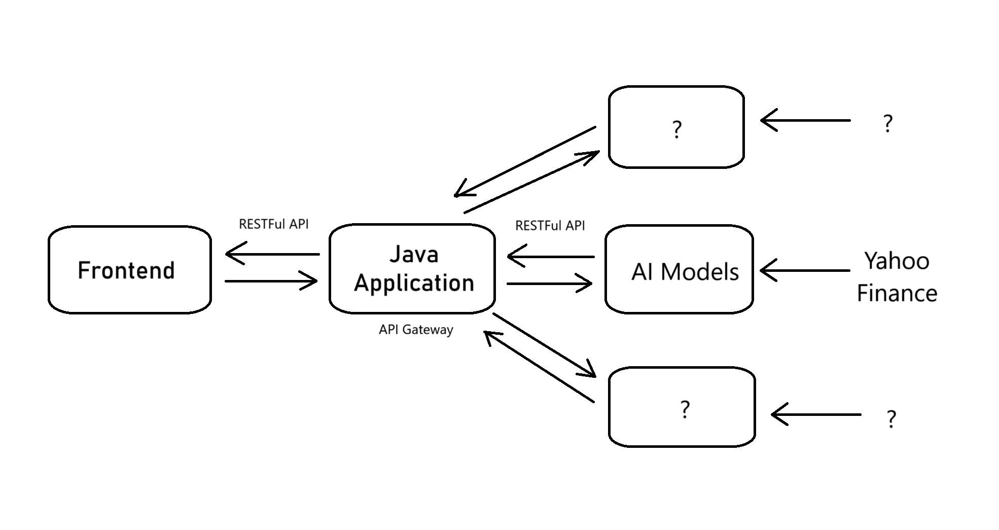

# Stonks Finance Project

**Stonks Finance** is an innovative platform for stock market enthusiasts, offering data visualization, AI-driven stock predictions, and an engaging user experience inspired by the popular "Stonks" meme. The application employs a microservices architecture to ensure scalability, flexibility, and seamless integration of additional features in the future.

## Microservices Architecture

The project consists of three key microservices:

### 1. **ms-main (API Gateway)**
- **Role**: Serves as the API Gateway for the system.
- **Responsibilities**:
  - Receives requests from the frontend.
  - Forwards appropriate requests to the AI microservice (`ms-ai-yahoo-finance`).
  - Handles responses from AI and returns them to the frontend.

### 2. **ms-ai-yahoo-finance**
- **Role**: AI microservice responsible for stock data analysis and predictions.
- **Responsibilities**:
  - Fetches stock data from Yahoo Finance.
  - Trains AI models on stock data to predict trends.
  - Exposes an API for querying stock changes and predictions.
- **Integration with ms-main**:
  - Responds to requests for stock analysis and prediction.

### 3. **Frontend**
- **Role**: Provides a user-friendly interface for the platform.
- **Responsibilities**:
  - Displays real-time stock data and AI predictions.
  - Indicates stock trends using visual modes:
    - **Stonks Mode**: For increasing stock values.
    - **Panic Mode**: For decreasing stock values.
- **Integration with ms-main**:
  - Sends all requests to `ms-main`, which forwards them to the appropriate backend service.

## Communication Between Microservices
The communication follows this flow:

1. **Frontend to ms-main**:
   - The frontend sends a user request (e.g., stock symbol search, prediction query) to `ms-main`.
   - Example: `GET /api/v1/stock_predictor/stock-overview`

2. **ms-main to ms-ai-yahoo-finance**:
   - `ms-main` forwards the request to `ms-ai-yahoo-finance`.
   - Example: `GET /stock-overview`

3. **ms-ai-yahoo-finance to Yahoo Finance**:
   - `ms-ai-yahoo-finance` fetches stock data from Yahoo Finance when required.
   - Example: Get overview of all stocks.

4. **Response Handling**:
   - `ms-ai-yahoo-finance` processes the request and sends a response to `ms-main`.
   - `ms-main` forwards the response to the frontend.

## Why Use an API Gateway?

The **API Gateway** pattern ensures:
- **Centralized Routing**: The frontend interacts with only one endpoint (`ms-main`).
- **Decoupled Frontend and Backend**:
  - Changes to backend services do not affect the frontend.
  - Backend services can evolve independently.
- **Scalability**: Easily integrates additional backend services, such as new AI modules for other stock markets.

## Future Prospects
The design of **Stonks Finance** ensures extensibility. Potential enhancements include:
- **Additional AI Microservices**:
  - Integrating data from other stock market providers.
  - Offering specialized AI models for different markets.
- **Advanced Analytics**:
  - Providing users with insights like volatility, risk assessment, and portfolio recommendations.

## Conclusion
**Stonks Finance** is designed to provide a delightful user experience, robust backend processing, and scalability for future growth. By leveraging microservices and an API Gateway, the platform ensures modularity and ease of maintenance while delivering high-quality stock insights.
